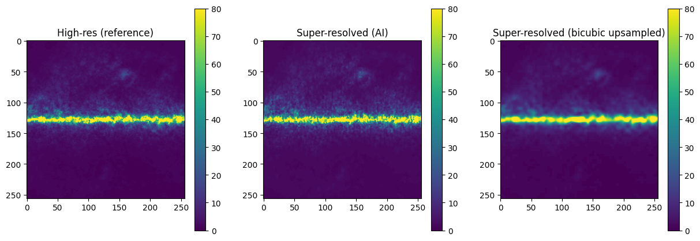
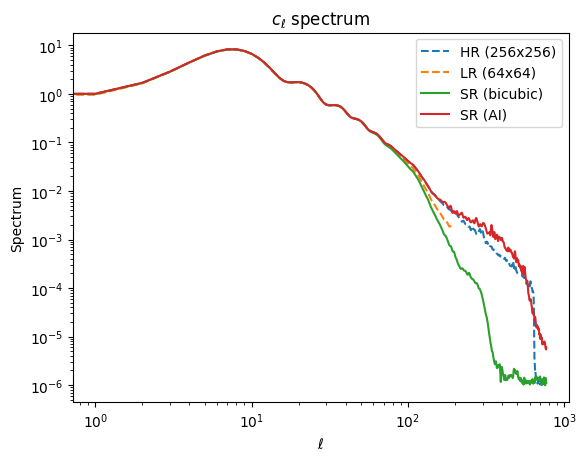

# Super Resolution modeling of PySM simulations

In this repository we show our progress in the training and modeling the [SR3 super resolution model](https://github.com/javierhndev/Super-Resolution-SR3) with PySM generated images. 

## PySM simulations and analysis
In the Notebook `generate_galactic_dust_realization` we do some exploration of [PySM](https://pysm3.readthedocs.io/en/latest/) simulations, [pixell](https://pixell.readthedocs.io/en/latest/) (to convert sky map to 2D), pillow usage, saving figures...

For the last version of the Notebook, check the date in front of the file as `YYYYMM_thenotebook`

## Dataset generation
The `dataset_generation.py` is a Python script that generates images from PySM simulations in 2D.

## Profiling
The performance of the SR3 model on the Voyager HPC system has been analyzed. Check [that section](20250905_voyager_profiling) for more details.

# Analysis of results
A complete simulation was performed to show that an AI (Super resolution based on diffusion) model can be used to enhance the resolution of PySM simulations of galactic dust. For simplicity we select a patch of the sky centered at the center of the galaxy. Our first step was to show we can enhace 64x64 images to a 256x256 resolution using AI. We have an analysis of the results from our last run called `256_set3_b` in a Juyter Notebook in `analysis_results/12-2025_data_analysis_256_set3_b.ipynb`.

The results from the AI model and a simple bicubic interpolation are discussed in detail the notebook. At naked eye, an enhanced image by AI looks very good compared to a simple bicubic interpolation (as shows in the following image)

And when the spectrum is calculated, AI results still shows a reasonable agreement with ground truth (HR).

